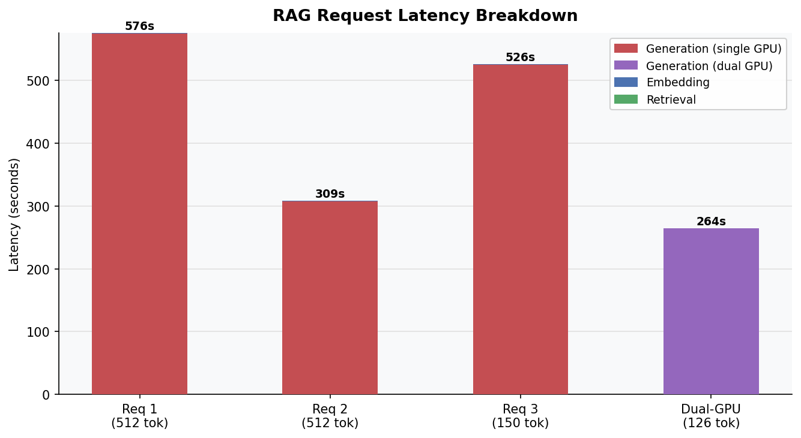
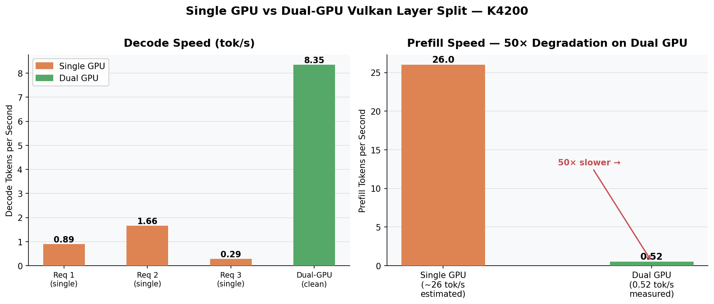
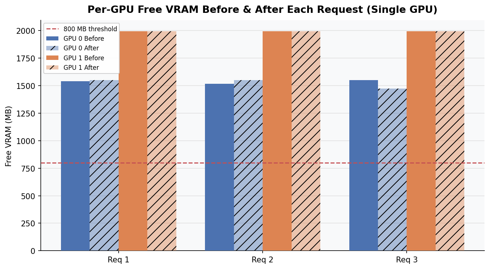
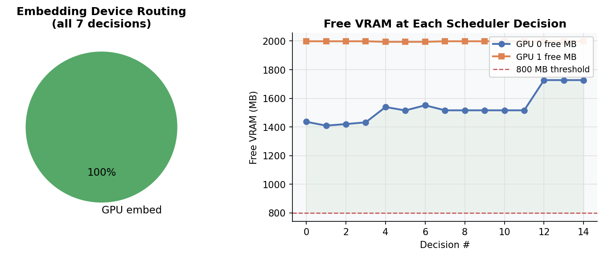

# LegacyRAG

[](LICENSE)
[](https://www.python.org/)
[](https://arxiv.org/)

A VRAM-aware Retrieval-Augmented Generation pipeline designed for legacy GPU hardware. Built for a research paper on inference constraints with dual NVIDIA Quadro K4200 GPUs (4 GB VRAM each) running llama.cpp via the Vulkan backend.

## What It Does

LegacyRAG solves a real problem: running a full RAG pipeline (embed → retrieve → generate) on GPUs that predate FP16, tensor cores, and NVLink. The key innovation is a VRAM-aware scheduler that queries `nvidia-smi` before every embedding operation and routes to CPU or GPU based on live free-VRAM thresholds — protecting generation VRAM while keeping embeddings fast.

```
POST /ingest  →  chunk → embed (VRAM-aware) → store
POST /query   →  embed query → cosine retrieve → generate → benchmark
```

## Hardware Target

| Component | Spec |
|---|---|
| GPU | 2× NVIDIA Quadro K4200 |
| VRAM | 4 GB GDDR5 per card |
| Architecture | Maxwell (2014), no FP16, no matrix cores |
| Inference backend | llama.cpp b5576 + Vulkan |
| LLM | phi3-mini (3.82B, Q4_0, ~2.1 GB) |
| Embedding model | nomic-embed-text via Ollama |

## Stack

- **FastAPI** — HTTP endpoints (`/ingest`, `/query`, `/health`, `/stress-test`)
- **llama.cpp server** — OpenAI-compatible generation on port 8080
- **Ollama** — nomic-embed-text embeddings on port 11434
- **numpy** — in-memory cosine similarity retrieval
- **nvidia-smi** — real-time per-GPU VRAM monitoring

## Key Features

- **Per-GPU VRAM scheduler** — checks both GPUs independently against an 800 MB threshold; logs every routing decision with timestamp to `schedule_decisions.jsonl`
- **GenerationContext guard** — while generation is active, embeddings are automatically blocked from GPU to prevent VRAM contention
- **Stall detection with retry** — streaming generation with two-phase timeout: 600s queue-wait, 45s inter-token. On stall, retries with progressively reduced context (all chunks → half → 1)
- **Benchmark logger** — records per-request latency breakdown, tok/s, and VRAM snapshots to `benchmark_results.json`
- **Stress test endpoint** — `POST /stress-test?n_concurrent=N` fires N concurrent requests and reports per-GPU VRAM delta, CPU fallback rate, and aggregate throughput

## Setup

### Prerequisites

```bash
# llama.cpp server with Vulkan backend running on port 8080
# Ollama running on port 11434
ollama pull nomic-embed-text
```

### Install

```bash
pip install -r requirements.txt
```

### Run

```bash
uvicorn main:app --host 0.0.0.0 --port 8001
```

### Ingest a document

```bash
curl -X POST http://localhost:8001/ingest \
  -H "Content-Type: application/json" \
  -d '{"text": "your document text here", "doc_id": "doc1"}'
```

### Query

```bash
curl -X POST http://localhost:8001/query \
  -H "Content-Type: application/json" \
  -d '{"question": "your question here", "top_k": 5, "max_tokens": 128}'
```

### llama-server (dual-GPU, recommended for benchmarking)

```bash
LD_LIBRARY_PATH=build/bin build/bin/llama-server \
  -m /path/to/phi3-mini.gguf \
  -ngl 99 \
  --split-mode layer \
  --tensor-split 1,1 \
  --main-gpu 0 \
  --port 8080 \
  --slots
```

## Benchmark Results

See [`paper_findings.md`](paper_findings.md) for the full research summary.

### Latency Breakdown


Generation dominates at **99.86% of total latency**. Embedding (0.6–0.8s) and retrieval (0.0002s) are negligible.

### Generation Speed — Single GPU vs Dual-GPU


| Config | Prefill tok/s | Decode tok/s |
|---|---|---|
| Single GPU (idle) | ~26 | ~9 |
| Single GPU (sustained load) | 1–6 | 0.29–1.66 |
| Dual GPU (idle, layer split) | **0.52** | **8.35** |

**Key finding:** Dual-GPU Vulkan layer split on Maxwell hardware degrades prefill by 50× due to inter-device synchronization overhead, while decode speed is unchanged.

### VRAM Usage Per Request


Both GPUs stayed well above the 800 MB threshold throughout all tests. The VRAM scheduler never triggered a CPU fallback during the baseline runs.

### VRAM Scheduler Decisions


All 7 embedding decisions routed to GPU. Free VRAM remained stable between 1,400–2,000 MB across both cards.

## Files

```
legacyrag/
  vram_scheduler.py   — per-GPU nvidia-smi monitoring + routing decisions
  embedder.py         — nomic-embed-text via Ollama, respects scheduler
  retriever.py        — cosine similarity store with disk persistence
  generator.py        — llama.cpp streaming client with stall detection
  pipeline.py         — ingest + query orchestration
  benchmark.py        — per-request logging + stress_test()
main.py               — FastAPI app
requirements.txt
paper_findings.md     — full benchmark writeup with tables
results_table.csv     — tabular export of benchmark_results.json
benchmark_results.json
stress_test_results.json
```

## Research Context

This system was built to document real-world inference performance on legacy data-center GPUs (Quadro K4200, EOL 2019) as part of an arXiv research paper on edge inference constraints. The goal is to characterize what RAG pipelines are feasible on hardware that institutions may still have deployed — and where the actual bottlenecks lie.

## Citation

If you use LegacyRAG in your research, please cite:

```bibtex
@misc{legacyrag2026,
  title   = {LegacyRAG: VRAM-Aware Retrieval-Augmented Generation on Legacy GPU Hardware},
  author  = {Azeez},
  year    = {2026},
  url     = {https://github.com/azeez-1904/LegacyRAG}
}
```

## License

MIT — see [LICENSE](LICENSE).
